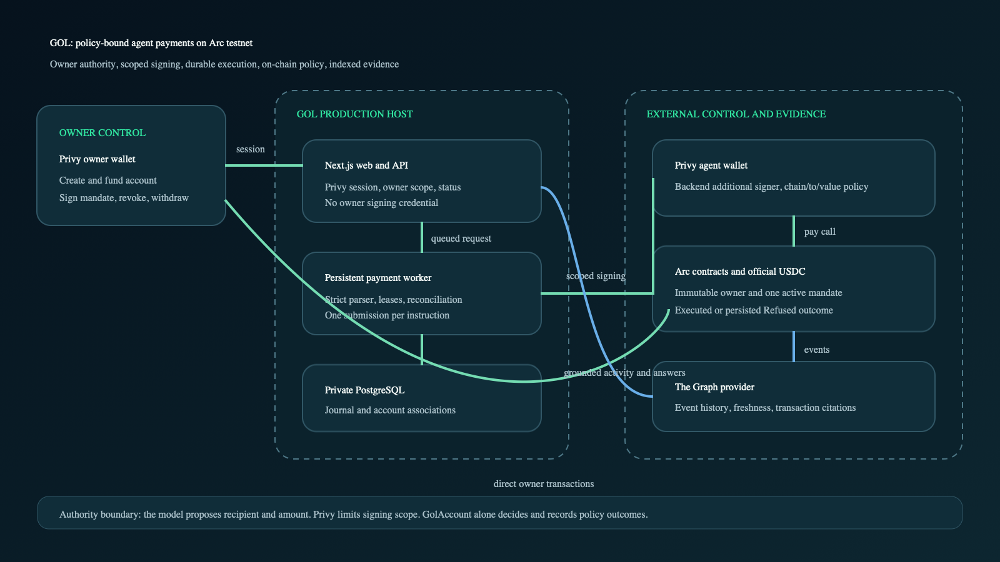
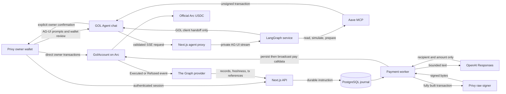

# GOL architecture



The editable source is [assets/architecture.svg](assets/architecture.svg). This document describes the implemented system. The authoritative detailed design remains [spec/architecture.md](spec/architecture.md).

## Authority and data flow



The model proposes a typed recipient and USDC amount from the owner's address book. It receives no signing tool. The worker supplies the random request ID, account, mandate, and verified wallet association. Privy restricts the backend signer's transaction envelope. `GolAccount` makes the authoritative policy decision.

The chat runtime is a separate Python LangGraph process. The browser uses the AG-UI `HttpAgent`
through a same-origin Next.js streaming proxy; the proxy and LangGraph service authenticate with an
internal shared secret in production. LangGraph discovers all connected Aave tool descriptions and
JSON schemas at startup, streams run/step/tool/text events, and can iterate through multiple Aave
read, simulation, and unsigned-preparation calls in one run. It has no database, Privy, AWS, or
owner-wallet credential.

GOL-native tools return typed client handoffs instead of executing writes. The browser maps each
handoff back to the existing account, consent, funding, mandate, payment, activity, or wallet-export
review. Aave transaction requests are schema-validated, displayed with chain, sender, destination,
value and calldata, and submitted only after the owner presses the wallet-review action. The
connected wallet address must equal the transaction's `from` address. Signed-order relay tools stay
blocked because they require a separate authenticated relay workflow.

## Contract boundary

The factory creates at most one immutable account for `msg.sender`. Each account fixes its owner and official Arc USDC token. One mandate is active at a time. A replacement revokes the prior mandate atomically.

For a well-formed request from the recorded agent, the account evaluates rules in this order:

1. Mandate revoked or inactive
2. Mandate expired
3. Recipient not allowed
4. Per-payment cap exceeded
5. Cumulative cap exceeded

A policy failure writes a `RequestRecord`, emits `Refused`, and returns normally. A valid payment writes effects before calling USDC under a reentrancy guard. If transfer fails, the whole transaction reverts, including the tentative record and spent counter. Malformed requests, caller violations, insufficient balance, and token failures are technical reverts and are not mislabeled as policy refusals.

The request key is `(account, mandateId, requestId)`. Its payload hash binds chain, account, mandate, caller, recipient, and amount. Replaying an identical payload returns the stored outcome without another transfer or event. Reusing the ID with a changed payload reverts.

## Signing boundary

The owner wallet signs account creation, funding, mandate creation, revocation, and withdrawal directly in the browser. Server authentication proves the Privy user subject, then the setup route verifies the linked owner against the contract before storing an association.

The separate agent wallet uses a backend additional signer. One canonical policy builder produces the rules submitted to Privy, the local assertion used in tests, and the disclosure shown to the owner before provisioning, so no second description can drift. The policy allows only `eth_signTransaction` when the chain is `5042002`, `to` is the linked GOL account, and native `value` is zero; every other method and transaction falls to Privy's default deny. No `ethereum_calldata` condition is enabled, so the policy is an envelope restriction and is never called `pay`-only. The contract still enforces the method caller, recipient, and budget. This intentional split allows an over-budget `pay` call to reach the contract and create a useful refusal record while preventing unrelated destination signing.

`PRIVY_AUTHORIZATION_KEY_ID` is the key-quorum/signer ID that owns `PRIVY_AUTHORIZATION_PRIVATE_KEY`. Startup validation rejects one without the other; the live policy probe proves the pair actually matches. Only Privy resource IDs and public wallet addresses are stored in PostgreSQL.

## Durable execution

The HTTP handler only validates and queues. A persistent worker claims PostgreSQL rows with leases and per-agent advisory locking. Its state sequence is:

```text
queued -> signing -> submitted -> pending -> executed | refused
       -> needs_clarification | signer_blocked | technical_failure | unknown
```

The parsed recipient and amount are persisted before signing. The worker constructs and validates a bounded EIP-1559 transaction, asks Privy to sign it, verifies the recovered agent address, and stores the exact raw bytes and local transaction hash before broadcasting through the configured Arc RPC. Recovery always reuses those stored bytes; it never re-signs after a raw transaction exists. A changed payload under an existing request ID remains a conflict. Browser local storage remembers the pending request ID, while the server journal remains the source of truth after refresh.

## Evidence and query boundary

The subgraph starts from `AccountCreated`, instantiates an account template, and indexes mandate plus outcome events. Every action includes the chain-derived transaction hash, block number, block hash, timestamp, and log index. The query adapter reports indexed block, chain head, deployment identifier, partial results, and indexing errors.

Outcome, rule, mandate, and timestamp filters are applied in GraphQL variables and the `where` clause before pagination; no page is fetched and then discarded. The visible timeline keeps deterministic sequence pagination with a strict maximum page size of 50. The question evidence loader may follow the cursor across pages but stops at 100 scoped records and reports the truncation as `partial`. Responses are validated for shape, hashes, amounts, account scope, and deployment metadata. An invalid response becomes unavailable or an integrity mismatch; it never becomes an empty result.

A confirmed receipt-derived `Executed` or `Refused` immediately produces an `On-chain; indexing pending` overlay carrying its request ID, transaction hash, outcome, amounts, and rule. Bounded backoff polling replaces that overlay with the indexed record, deduplicated by request ID and transaction hash so one business event is never shown twice. After the automatic window the confirmed overlay is retained with a `Check indexing again` action, and a temporary Graph failure keeps the last successful indexed timeline with its last indexed block and a stale or unavailable badge.

The question route fetches scoped Graph records before optional model phrasing. Citations are constructed by code from the returned records. Empty, stale, partial, unavailable, and model-error states remain distinct. A fixture is available only for explicitly labeled local UI review and is never treated as partner evidence.

## Production boundary

One existing EC2 host named `gol-production` is the selected target. Docker Compose runs Caddy, Next.js, the private LangGraph/AG-UI service, one payment worker, and PostgreSQL. PostgreSQL stays on the internal network and publishes no host port. LangGraph and the worker join both networks for bounded outbound provider access while publishing no inbound host port. Only the worker receives payment-signing authority; the LangGraph container receives only its model key, Aave endpoint, and internal proxy secret. Caddy is the only public ingress. Separate admin and runtime roles limit schema and application access. Backups are compressed and encrypted into a private S3 bucket, and restore drills use an isolated `gol_restore_` database.

Browser configuration is parsed and validated on the server at request time, so one built image is configured when it starts. Invalid or missing production fields fail with field names and never with values.

Subgraph Studio and Aave MCP are external. No Graph Node, IPFS service, Vercel function, or cron worker is part of the design. `/api/health` actively verifies LangGraph, the database and the Arc chain ID, reports Privy and model configuration presence, and performs one small bounded Graph metadata query. It never makes a paid model call and never returns a secret, wallet ID, or internal error body.

## Failure interpretation

| Observation         | Meaning                                                                             | Evidence                                                     |
| ------------------- | ----------------------------------------------------------------------------------- | ------------------------------------------------------------ |
| `executed`          | USDC transfer transaction finalized and contract record reconciled                  | receipt, request getter, Graph action                        |
| `refused`           | Direct `pay` transaction finalized but contract policy denied transfer              | receipt, stored refusal, Graph action                        |
| `signer_blocked`    | Policy, mandate, signer, or gas checks denied the transaction before Arc submission | local/provider error, no Arc refusal                         |
| `technical_failure` | Parsing provider, RPC, token, balance, auth, or deterministic runtime failure       | journal error code, possibly a reverted tx                   |
| `unknown`           | Submission may have occurred but final outcome is not yet provable                  | provider operation ID or tx hash retained for reconciliation |

These categories prevent a successful refusal transaction from appearing as a failed transaction and prevent a missing receipt from appearing as payment success.
