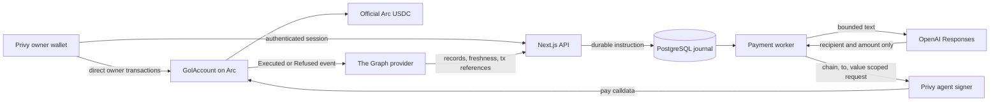

# GOL architecture


The editable source is [assets/architecture.svg](assets/architecture.svg). This document describes the implemented system. The authoritative detailed design remains [spec/architecture.md](spec/architecture.md).

## Authority and data flow



The model proposes a typed recipient and USDC amount from the owner's address book. It receives no signing tool. The worker supplies the random request ID, account, mandate, and verified wallet association. Privy restricts the backend signer's transaction envelope. `GolAccount` makes the authoritative policy decision.

## Contract boundary

The factory creates at most one immutable account for `msg.sender`. Each account fixes its owner and official Arc USDC token. One mandate is active at a time. A replacement revokes the prior mandate atomically.

For a well-formed request from the recorded agent, the account evaluates rules in this order:

1. Mandate revoked or inactive
2. Mandate expired
3. Recipient not allowed
4. Per-payment cap exceeded
5. Cumulative cap exceeded

A policy failure writes a `RequestRecord`, emits `Refused`, and returns normally. A valid payment writes effects before calling USDC under a reentrancy guard. If transfer fails, the whole transaction reverts, including the tentative record and spent counter. Malformed requests, caller violations, insufficient balance, and token failures are technical reverts and are not mislabeled as policy refusals.

The request key is `(account, mandateId, requestId)`. Its payload hash binds chain, account, mandate, caller, recipient, and amount. Replaying an identical payload returns the stored outcome without another transfer or event. Reusing the ID with a changed payload reverts.

## Signing boundary

The owner wallet signs account creation, funding, mandate creation, revocation, and withdrawal directly in the browser. Server authentication proves the Privy user subject, then the setup route verifies the linked owner against the contract before storing an association.

The separate agent wallet uses a backend additional signer. Its Privy policy limits transactions to Arc chain ID `5042002`, the linked GOL account, and zero native value. The contract still enforces the method caller, recipient, and budget. This intentional split allows an over-budget `pay` call to reach the contract and create a useful refusal record while preventing unrelated destination signing.

## Durable execution

The HTTP handler only validates and queues. A persistent worker claims PostgreSQL rows with leases and per-agent advisory locking. Its state sequence is:

```text
queued -> signing -> submitted -> pending -> executed | refused
       -> needs_clarification | signer_blocked | technical_failure | unknown
```

Provider operation ID and transaction hash are stored before receipt polling. After a process restart or ambiguous provider response, the worker checks saved provider state, receipt, and the on-chain request getter before it considers retrying. It reuses the same request ID and payload. Browser local storage remembers the pending request ID, while the server journal remains the source of truth after refresh.

## Evidence and query boundary

The subgraph starts from `AccountCreated`, instantiates an account template, and indexes mandate plus outcome events. Every action includes the chain-derived transaction hash, block number, block hash, timestamp, and log index. The query adapter reports indexed block, chain head, deployment identifier, partial results, and indexing errors.

The question route fetches scoped Graph records before optional model phrasing. Citations are constructed by code from the returned records. Empty, stale, partial, unavailable, and model-error states remain distinct. A fixture is available only for explicitly labeled local UI review and is never treated as partner evidence.

## Production boundary

One existing EC2 host named `gol-production` is the selected target. Docker Compose runs Caddy, Next.js, one payment worker, and PostgreSQL. PostgreSQL is reachable only on the internal network. Separate admin and runtime roles limit schema and application access. Backups are compressed and encrypted into a private S3 bucket, and restore drills use an isolated `gol_restore_` database.

Subgraph Studio is external. No Graph Node, IPFS service, Vercel function, or cron worker is part of the design. `/api/health` is ready only when the database responds and RPC, Graph, full Privy signing/authentication, and model configuration are present.

## Failure interpretation

| Observation         | Meaning                                                                       | Evidence                                                     |
| ------------------- | ----------------------------------------------------------------------------- | ------------------------------------------------------------ |
| `executed`          | USDC transfer transaction finalized and contract record reconciled            | receipt, request getter, Graph action                        |
| `refused`           | Direct `pay` transaction finalized but contract policy denied transfer        | receipt, stored refusal, Graph action                        |
| `signer_blocked`    | Privy denied the transaction before Arc submission                            | provider error, no Arc refusal                               |
| `technical_failure` | Parsing provider, RPC, token, balance, auth, or deterministic runtime failure | journal error code, possibly a reverted tx                   |
| `unknown`           | Submission may have occurred but final outcome is not yet provable            | provider operation ID or tx hash retained for reconciliation |

These categories prevent a successful refusal transaction from appearing as a failed transaction and prevent a missing receipt from appearing as payment success.
