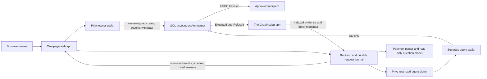

# GOL hackathon architecture

Status: proposed, 8 September 2026. Read [product specification](hackathon-product-spec.md) first. This is a design, not a deployment report.

## 1. Components and authority



One pnpm workspace: `contracts/` Foundry; `subgraph/` Graph CLI and AssemblyScript; `agent/` TypeScript payment runner/query service/CLI; `web/` Next.js app with server routes; `packages/protocol/` generated ABI and transport schemas. Both frontend and backend run on the AWS EC2 instance `gol-production`, selected by Anderson and administered through AWS CLI. A Next.js Node server serves the page and server routes; a separate persistent worker runs the agent payment jobs. No separate NestJS deployment is needed. PostgreSQL on the same VM provides the durable request journal; it is not the activity source of truth. Subgraph Studio provides the external subgraph deployment/testing environment; no Graph Node or IPFS service is self-hosted.

The selected agent interface is the standalone runner with web access and a developer CLI. MCP servers, Codex MCP connections, and Graph MCP integrations are out of scope by Anderson's explicit direction. The Graph is accessed through the defined GraphQL queries.

Owner keys stay in the owner wallet. The backend receives an authorization key for a signer on a distinct agent wallet. That wallet is not owner of the account and cannot change a mandate or withdraw. The contract accepts no arbitrary target, arbitrary calldata, approval, delegatecall, upgrade, or module installation. Compromising the runtime can cause spending within the owner's grant, malicious attempts, gas loss in the agent wallet, or unavailability. It cannot expand the contract's mandate. Do not claim that backend compromise cannot cause any loss.

A model is an untrusted parser/explainer, not an authority boundary. Recipient identity, business purpose, and instruction correctness remain owner/runtime concerns within the granted cap. The contract authenticates an address, not whether software is AI.

## 2. Network and supported integration evidence

| Item | Configuration | Evidence status |
|---|---|---|
| Arc testnet | EVM chain ID `5042002`, RPC `https://rpc.testnet.arc.network` | Officially documented; read-only JSON-RPC probes from this environment returned HTTP 403 on 8 September |
| USDC payment interface | `0x3600000000000000000000000000000000000000`, six decimals | Official Arc contract reference; decimals and transfer behavior must be checked on live RPC in M0/M1 |
| Native gas | USDC, eighteen decimal base units | Same underlying balance as ERC-20 representation; never sum both balances |
| The Graph | Manifest `network: arc-testnet`, chain `eip155:5042002` | Exact network listed by The Graph; our Studio deployment and API-key query are not yet proven |
| Privy | Custom EVM chain, owner wallet, separate agent wallet, restricted signer policy | Documented primitives; actual GOL app provisioning and signing are untested |

Sources: [Arc connection](https://docs.arc.io/arc/references/connect-to-arc), [USDC address](https://docs.arc.io/arc/references/contract-addresses), [balance model](https://docs.arc.io/arc/concepts/stablecoin-native-model), [Graph Arc testnet](https://thegraph.com/docs/en/supported-networks/arc-testnet/), [Privy custom networks](https://docs.privy.io/basics/react/advanced/configuring-evm-networks).

Studio support in documentation is enough to select the intended design, not enough to mark the integration complete. Gate M2 on indexing our real events. If unavailable: first ask the provider for the correct supported configuration, then propose a hosted Graph provider for the same chain with written partner acceptance. Self-hosted Graph Node can index EVM networks but does not automatically satisfy the live-provider prize requirement. A chain or provider change requires a documented product decision; do not substitute silently. [Graph support guidance](https://thegraph.com/docs/en/supported-networks/)

## 3. Contract model

`GolAccountFactory` deploys one non-upgradeable `GolAccount` per owner through `createAccount()`. `msg.sender` is the immutable owner; no arbitrary owner parameter. `accounts(owner)` returns an existing account; a repeat call returns it without deploying or emitting another creation. Factory token is the constant official Arc USDC interface. Factory registry is convenient discovery, not authority over created accounts. Deployments on an unintended chain are rejected by the deployment script and frontend configuration.

`GolAccount` uses immutable `owner` and `usdc`, a monotonic `nextMandateId`, and one `activeMandateId`. A new mandate atomically marks the previous one revoked. Agent must be nonzero and different from owner/account/token addresses. Contract wallets as agents are not needed for P0; the supported client is an EOA. Contract authorization relies on `msg.sender`, not `tx.origin`.

### Interfaces

```solidity
// Interface specification only; implementation starts after approval.
function createMandate(address agent, uint256 perPaymentCap,
    uint256 cumulativeCap, uint64 expiresAt, address[] calldata recipients)
    external returns (uint256 mandateId);
function revokeMandate(uint256 mandateId) external;
function withdraw(uint256 amount) external; // destination always immutable owner
function pay(uint256 mandateId, bytes32 requestId, address recipient,
    uint256 amount) external returns (Outcome outcome);
function getMandate(uint256 mandateId) external view returns (Mandate memory);
function getRecipients(uint256 mandateId) external view returns (address[] memory);
function getRequest(uint256 mandateId, bytes32 requestId)
    external view returns (RequestRecord memory);
function remaining(uint256 mandateId) external view returns (uint256);
```

Amounts are unsigned six-decimal integers. All writes except native funding `receive()` are nonpayable. `createMandate`, `revokeMandate`, and `withdraw` require the owner. No owner administrative key exists at the factory or backend.

Creation validation: both caps positive; per-payment cap <= cumulative cap; expiry strictly after current block time and <=30 days ahead; one to twenty unique nonzero recipients, excluding account and token addresses. Reject invalid configuration atomically with custom errors. Empty allowlist is deny-all in the policy logic, even though public creation prevents an empty list. Recipients and terms cannot be edited in place.

Funding is a direct `USDC.transfer(account, amount)` from the owner wallet, requiring no approval. Anyone can transfer USDC to an account; it becomes withdrawable by its owner and does not reset spending. A payable `receive()` accepts native USDC deposits because both interfaces expose the same balance. No native outbound payment function exists. Owner withdrawal uses the ERC-20 interface and leaves sub-micro-USDC precision dust if present; the product describes withdrawal of the displayed six-decimal balance, not all possible native-unit dust. Other tokens and their recovery are out of scope; warn against sending them.

### Stored types

```text
Mandate {
  agent: address, perPaymentCap: uint256, cumulativeCap: uint256,
  spent: uint256, expiresAt: uint64, revoked: bool, exists: bool
}
Outcome = UNSEEN(0) | EXECUTED(1) | REFUSED(2)
Rule = NONE(0) | MANDATE_REVOKED(1) | MANDATE_EXPIRED(2)
     | RECIPIENT_NOT_ALLOWED(3) | PER_PAYMENT_CAP(4) | CUMULATIVE_CAP(5)
RequestRecord {
  payloadHash: bytes32, agent: address, recipient: address,
  attempted: uint256, headroom: uint256, spentAfter: uint256,
  outcome: Outcome, rule: Rule, reason: string,
  recordedAt: uint64, sequence: uint256
}
```

Request key is `(account, mandateId, requestId)`. Payload hash is `keccak256(abi.encode(block.chainid, address(this), mandateId, msg.sender, recipient, amount))`. A request ID is a random nonzero bytes32 generated once by the client/runtime, never invented by the LLM. Account and chain separation are explicit in the payload binding. Each newly persisted outcome increments the account-wide sequence once.

### Evaluation order and exact failure semantics

1. Acquire reentrancy guard. Reject unknown mandate, caller other than its recorded agent, zero request ID, zero recipient, or zero amount with a custom error. These are malformed/unauthorized requests, not policy records. Unknown mandate cannot attribute a real agent.
2. If request exists, require identical payload hash. Same payload returns its stored outcome without transferring, updating counters, or emitting another outcome event. A changed payload reverts `RequestConflict`. Authorization still applies to duplicates. A prior result remains retrievable after expiry/revocation.
3. Snapshot `headroom = cumulativeCap - spent`; invariant guarantees no underflow. Evaluate the policy in this order: revoked/inactive, expired (`block.timestamp >= expiresAt`), recipient not allowed, amount > per-payment cap, amount > headroom. When several rules fail, only the first is recorded. No silent partial payment.
4. On policy failure, persist `REFUSED` with the pre-attempt headroom, unchanged `spentAfter`, and canonical reason below; emit `Refused`; return `REFUSED` without reverting. It performs no token external call. `headroom` always means cumulative remaining budget, even when a different rule failed.
5. If policy passes, read token balance. Balance < amount reverts `InsufficientFunds(balance, amount)`. A token read failure is technical. Neither consumes request ID or budget.
6. Use checks-effects-interactions: tentatively increase spent and store executed record, then `SafeERC20.safeTransfer(recipient, amount)` under the reentrancy guard, then emit `Executed`. If transfer reverts or returns false, the complete transaction reverts, restoring request and spent. Only the fixed official token is supported; fee-on-transfer or rebasing-token semantics are not generalized.

Reason strings are contract-defined constants, not agent input: `Mandate revoked`, `Mandate expired`, `Recipient not allowed`, `Per-payment cap exceeded`, `Cumulative cap exceeded`. Rule is machine-readable; reason is a stable human-readable label. The UI computes numeric explanation from event fields.

`Refused` survives because its enclosing transaction succeeds. Emitting before a revert would erase it. If the entire outer transaction runs out of gas, or an enclosing contract caller subsequently reverts, the record also disappears. The supported agent sends a direct transaction. The guarantee is for finalized successful executions of `pay`, not every intention or network submission.

### Events

```solidity
event AccountCreated(address indexed owner, address indexed account);
event MandateCreated(uint256 indexed mandateId, address indexed agent,
    uint256 perPaymentCap, uint256 cumulativeCap, uint64 expiresAt,
    address[] recipients);
event MandateRevoked(uint256 indexed mandateId, address indexed agent);
event Executed(uint256 indexed mandateId, bytes32 indexed requestId,
    address indexed agent, address recipient, uint256 amount,
    uint256 headroom, uint256 spentAfter, uint256 sequence);
event Refused(uint256 indexed mandateId, bytes32 indexed requestId,
    address indexed agent, address recipient, uint8 rule,
    uint256 attempted, uint256 headroom, uint256 spentAfter,
    string reason, uint256 sequence);
event Withdrawn(address indexed owner, uint256 amount);
```

Account address comes from log emitter. Headroom for `Executed` is post-payment; for `Refused` it is unchanged pre-attempt headroom. Both represent remaining headroom after the recorded outcome. Block, timestamp, transaction hash, and log index come from chain metadata, not a caller-supplied field. Stored request getters make a refusal inspectable even without an indexer. Logs provide its transaction reference.

### Concurrency and replay

The chain serializes requests. Two payments racing for remaining budget cannot both exceed it because the second execution reads updated spent. For example, with 60 left, concurrent 40 and 30 requests allow only the first included and refuse the other. A concurrent withdrawal may cause a later otherwise-authorized payment to fail for balance; it does not create extra budget. Owner replacement/revocation takes effect at its transaction's position.

New request IDs after a refusal create new attempts, as intended. The backend never retries a refused instruction under a new ID automatically. Same-ID retries are safe on-chain. A distinct instruction to pay the same recipient/amount is a new ID. There is no claim of business-level invoice deduplication.

## 4. Privy control and signing

Owner wallet W owns the GOL account. A second Privy wallet A is owned by the same authenticated user but has a backend additional signer with a policy. The backend signer has no resource ownership or policy-editing credential. Provisioning and changes require user authorization. Per-user account/agent associations are verified server-side and on-chain, never accepted from a model-produced wallet ID. [Privy owner and signer permissions](https://docs.privy.io/controls/authorization-keys/owners/overview)

Policy intent: allow only the signing/broadcast method selected during M0, on chain 5042002, with transaction `to` equal to this GOL account and `value` zero. Every other method defaults to denial, including raw/typed-message signatures, export, delegated authorization, and batched calls. Exact `pay` function filtering using ABI-aware calldata conditions is desirable and tested if used; restricting chain, account, and zero native value is the minimum meaningful policy. Owner-only contract methods remain inaccessible to A regardless of the signer policy.

Do not duplicate spending or recipient limits in Privy: validly encoded over-limit requests must reach the contract to produce its refusal. Show `Signer blocked before submission` for a Privy rejection; it has no Arc refusal receipt. Prove the control with one allowed GOL call and one wrong-destination signing request denied by Privy. Current docs define chain/to/value conditions and default-deny behavior; app access and exact SDK request shapes are M0 checks. [Privy policies](https://docs.privy.io/controls/policies/overview)

Gas funding is a small explicit owner-to-agent transfer outside the mandate. Show it separately, never include it in the 100 USDC cap. No unlimited automatic gas replenishment. Owner can remove the signer; on-chain revoke is the definitive account authority kill switch. Owner key export applies to W; the backend signer cannot export either wallet's key.

## 5. Runtime, journal, and interfaces

OpenAI Responses with strict JSON Schema is the proposed model adapter, using `gpt-5.5-2026-04-23` as an explicit initial snapshot subject to an authenticated availability test. This is a stable configuration choice, not a claim it is the cheapest/current flagship. Use `store: false`, bounded inputs, and no browsing/shell tools. At most one parsing call and one payment submission per instruction. Question interpretation and explanation are read-only. Model refusal, timeout, invalid output, and provider errors never trigger a payment. [Structured outputs](https://developers.openai.com/api/docs/guides/structured-outputs), [model capabilities](https://developers.openai.com/api/docs/models/gpt-5.5)

### Typed application operations

```typescript
type PaymentIntent = { recipient: `0x${string}`; amountUsdc: string };
type PaymentResult = {
  requestId: `0x${string}`;
  state: 'queued' | 'needs_clarification' | 'signing' | 'submitted' | 'pending' | 'executed'
    | 'refused' | 'signer_blocked' | 'technical_failure' | 'unknown';
  txHash: `0x${string}` | null;
  rule: string | null; attemptedUnits: string | null;
  headroomUnits: string | null; indexed: boolean;
};
parseInstruction(text: string, recipients: RecipientLabel[]): Promise<
  { kind: 'payment'; intent: PaymentIntent }
  | { kind: 'clarification'; message: string }>;
submitPayment(context: VerifiedAgentContext, requestId: Hex,
  mandateId: string, intent: PaymentIntent): Promise<PaymentResult>;
getPayment(context: VerifiedAgentContext, requestId: Hex): Promise<PaymentResult>;
getActivity(scope: AccountScope, filter: ActivityFilter): Promise<ActivityPage>;
answerQuestion(scope: AccountScope, question: string): Promise<GroundedAnswer>;
```

`Hex` is a validated 0x-prefixed hex string. `RecipientLabel` holds an owner-set label and validated address. `VerifiedAgentContext` is created only by server authentication and account ownership checks and contains chain ID, account, agent address, Privy agent wallet ID, and user subject. `AccountScope` contains validated chain/account and optional mandate/agent. `ActivityFilter` contains outcome, rule, inclusive from/to timestamps, first <=50, and cursor. `ActivityPage` and `GroundedAnswer` use the schemas below. These types are defined centrally in `packages/protocol/src/types.ts`.

Payment amount regex: `^(0|[1-9][0-9]*)(\.[0-9]{1,6})?$`, then reject zero and uint256 overflow. No exponents, commas, signs, more than six fractional digits, or JavaScript Number conversion. Contract receives bigint units parsed by viem. Address checksum/length validation precedes signing.

### HTTP API

| Route | Request | Response and behavior |
|---|---|---|
| `GET /api/health` | none | 200 public configuration and component health; no secrets; 503 if required dependencies unavailable |
| `GET /api/account` | Privy session | Owner/account/agent association, live mandate and balances, chain read timestamp |
| `POST /api/agent/setup` | Privy session and user-approved provisioning proof | Agent wallet and scoped signer policy identifiers; idempotent for account |
| `POST /api/instructions` | session, `requestId`, `mandateId`, `text` <=2000 chars | 202 journal row and state; async worker parses and submits; 409 for same-ID changed input; clarification never submits |
| `GET /api/requests/{requestId}` | same owner session | 200 result and receipts; 404 for unknown or another user's request |
| `GET /api/activity` | account, filters, cursor | Real Graph `ActivityPage`; public for known demo account; never raw arbitrary GraphQL proxy |
| `POST /api/questions` | session, account, question <=1000 chars, optional filter | `GroundedAnswer`; read-only, rate-limited |
| `GET /api/demo` | none | Read-only demo deployment and indexed evidence; no ability to invoke the demo agent |

Owner creation/funding/mandate/revoke/withdraw calls go directly from the browser wallet to chain. Backend never returns an arbitrary owner signature request. Requests require verified Privy token, session-bound owner/account, exact Origin for browser writes, strict body schema, 16KB body cap, and no permissive CORS. Budget: five payment instructions per minute per user, one active worker per agent, ten questions per minute. These server limits prevent abuse, not authority bypass by someone holding the scoped key.

Durable Postgres tables: `account_links(user_subject PK, owner_address UNIQUE, account_address UNIQUE, agent_wallet_id, agent_address, policy_id)`; `requests(id UUID PK, account_address, mandate_id numeric(78,0), request_id char(66), input_hash, text, parsed_recipient, parsed_amount numeric(78,0), state, provider_operation_id, tx_hash, tx_nonce, receipt_block, receipt_hash, error_code, lease_until, created_at, updated_at, UNIQUE(account_address, mandate_id, request_id))`. Address-book labels live in `recipients(account_address,address,label)` with a compound unique key. No private keys in DB. Raw input is private, retained seven days, excluded from public logs and model query evidence.

Worker claiming uses a transaction and row lock; per-agent advisory lock serializes nonce allocation. A persistent worker on `gol-production` polls durable queued rows every two seconds when idle, using bounded jobs and renewable leases. Process restarts reconcile existing submissions before signing again; never rely on work left running inside an HTTP response handler. Store provider operation ID before polling. If signing submission outcome is ambiguous, reconcile provider status and on-chain request getter/logs before any retry. Reuse the same request ID and payload. Track replacement transaction hashes under one journal entry. Do not resubmit with a fresh nonce/ID merely because receipt polling timed out. Reconciliation runs on GET and worker ticks so a page refresh is recoverable.

CLI commands after implementation: `pnpm --filter @gol/agent cli pay --mandate <id> --request <id> --instruction '<text>'`; `... status --request <id>`; `... ask --question '<text>'`. The baseline CLI is developer-only and invokes the same runner with a locally verified GOL server context and scoped agent credential. It accepts no owner private key or arbitrary write request. A public CLI login/token service is excluded. Normal owner access is the authenticated browser workflow. SKILL.md must distinguish this developer runner from a generally available public CLI.

## 6. Graph data and queries

Factory event creates an account data-source template from its deployment block. It indexes subsequent account events. Account creation and mandate creation are separate transactions to avoid relying on same-transaction template activation. Manifest pins deployed factory, start block, ABI, and `arc-testnet`. Generated ABI is shared; schema/mapping drift fails CI.

```graphql
type Account @entity(immutable: true) {
  id: Bytes!
  owner: Bytes!
  createdAtBlock: BigInt!
  createdAt: BigInt!
}
type Mandate @entity(immutable: false) {
  id: ID!
  account: Account!
  mandateId: BigInt!
  agent: Bytes!
  perPaymentCap: BigInt!
  cumulativeCap: BigInt!
  spent: BigInt!
  expiresAt: BigInt!
  recipients: [Bytes!]!
  revoked: Boolean!
}
type Action @entity(immutable: true) {
  id: Bytes!
  account: Account!
  mandate: Mandate!
  requestId: Bytes!
  agent: Bytes!
  recipient: Bytes!
  outcome: String!
  rule: String!
  reason: String!
  attempted: BigInt!
  transferred: BigInt!
  headroom: BigInt!
  spentAfter: BigInt!
  sequence: BigInt!
  transactionHash: Bytes!
  blockNumber: BigInt!
  blockHash: Bytes!
  timestamp: BigInt!
  logIndex: BigInt!
}
```

Mandate ID is `lowercase(account) + ':' + decimal(mandateId)`. Action ID is `transactionHash.concatI32(logIndex)` within this single-chain deployment. Graph handler stores the event's headroom and spentAfter, not a later contract read. Refused has `transferred=0`; executed has `transferred=attempted`, rule `NONE`, reason `Payment executed`. Revocation updates only mandate status; old Action rows remain immutable. Restart/reindex derives identical IDs and values.

```graphql
query Refusals($account: Bytes!, $first: Int!, $before: BigInt!) {
  actions(first: $first, orderBy: sequence, orderDirection: desc,
    where: {account: $account, outcome: "REFUSED", sequence_lt: $before}) {
    id requestId agent recipient rule reason attempted headroom spentAfter
    transactionHash blockNumber blockHash timestamp logIndex sequence
  }
  _meta { block { number hash timestamp } hasIndexingErrors deployment }
}
```

Additional persisted query templates filter by agent, mandate, outcome, rule, or bounded time interval, always within account scope. Cursor is last account sequence; immutable outcomes make it stable. Fetch page size 50; answer context max 200 rows and label truncation. For an all-time count, paginate all qualifying rows or answer that the visible window is partial. Never present a 50-row page as complete history. Activity queries use the configured provider endpoint and API key held on the server. Studio staging and published-network gateway endpoints are different; store the actual verified endpoint in deployment metadata without secrets. [Graph deployment lifecycle](https://thegraph.com/docs/en/subgraphs/quick-start/)

## 7. Confirmation, freshness, and integrity

Arc documents deterministic finality on inclusion. UI states are pending then final, with a separate final outcome. Do not add an Ethereum-style twelve-confirmation counter. A final reverted transaction is still a technical failure. Match receipt chain, destination, sender, request ID, and event fields before declaring a payment/refusal. Status success without an expected event is `unknown` until the stored request/logs reconcile; duplicate receipts may intentionally contain no new event. [Arc transaction lifecycle](https://docs.arc.io/integrate/wallets/transaction-lifecycle)

Poll receipt every two seconds, mark pending/unknown after 60 seconds, retain its hash, and continue recoverable polling. Graph polls every three seconds while catching up, backing off to fifteen seconds after 60 seconds. Indexing target is <=30 seconds under normal demo conditions, an application target measured in M2, not a provider SLA. More than 60 seconds behind chain timestamps, indexing errors, or failure to include the latest known receipt marks stale. `_meta` unavailable means freshness unknown. If RPC is down, do not label Graph current merely because its last query succeeded.

`ActivityPage` includes `records`, `cursor`, `indexedBlock`, `indexedBlockHash`, `indexedAt`, `chainHeadBlock`, `hasIndexingErrors`, `freshness(current|catching_up|stale|unknown|unavailable)`, `sourceDeployment`, and `partial`. Big integers serialize as decimal strings. Graph may be ahead of a lagging RPC: flag uncertainty and recheck rather than discarding records.

Ordinary Arc committed-block reorgs are not expected under its documented model. Nevertheless test inconsistent RPCs, subgraph rollback/redeployment, testnet reset, removed receipts, and changed block hashes. On mismatch, invalidate affected local receipt overlays and answers, refetch the canonical records, and show `Data being rechecked`; never continue asserting a paid state from an orphaned local row. A deployment change clears cursor/cache namespace. Postgres journal is workflow history, not proof that chain data survived a reset.

## 8. Grounded questions

Model first selects a bounded query intent: activity, payment outcome, refusal reason, or remaining-budget explanation for a specific historical action. Account scope is injected by code. It cannot change owner, endpoint, query text, or turn a question into payment. Unknown question intent receives a supported-capabilities response.

Retrieve Graph records and metadata before explaining. `GroundedAnswer` contains `status(answer|empty|partial|stale|unavailable|model_error)`, `text`, `citations[{actionId,txHash,logIndex,explorerUrl}]`, `indexedBlock`, `sourceDeployment`, `recordCount`, and `partial`. Generate citation URLs deterministically from validated hashes and configured explorer; never accept model-created URLs. Model output must reference only provided action IDs. Reject hallucinated IDs or numerical claims that cannot be matched to evidence; show a deterministic fact table and `Explanation unavailable` if validation fails.

For the acceptance case, render numbers from event data: 70 requested, 60 remaining, 40 spent, 100 cap from indexed mandate. The explanation can paraphrase the rule but cannot invent motives such as fraud or invoice invalidity. Empty answers say `No matching refusals indexed through block B`. Stale answers say `Based on records through block B; newer actions may be missing`. Provider failure never returns an empty array as if successful. Do not substitute RPC data as Graph-grounded evidence; a receipt may be shown separately while its indexed record is pending.

Keep approved payment-parser and question prompts in `spec/prompts/`; record model/config and prompt hash for each development run without private reasoning or secrets. Runtime prompt injection tests include recipient labels and questions instructing the model to ignore the contract, invent citations, or call payment tools. The question path has no signing dependency at all.

## 9. Security and deployment limits

Tests must cover policy boundaries, caller authentication, immutable owner, no arbitrary call/approval bypass, reentrancy, replay, concurrency, transfer rollback, data freshness, authorization cross-user isolation, real Privy denial, and live index consistency. See [implementation plan](implementation-plan.md) for executable acceptance cases.

Use testnet-only fresh deployment credentials. No credentials, wallet identities, live account state, contract addresses, or configuration from an earlier product become GOL configuration. App-specific credentials and hosting account access are prerequisites. Put secrets in hosting secret stores; publish only addresses, transaction hashes, ABI, compiler settings, subgraph deployment ID, and prompt/source attribution. Confirm wrong-chain refusal on every entry point.

This is an unaudited testnet MVP. Owner control does not remove contract defects, token-level restrictions, wallet compromise, or provider availability risk. No mainnet deployment is included or implied.

## 10. EC2 deployment topology and operations

Selected target: EC2 instance named `gol-production`. AWS CLI is the infrastructure administration interface. A local read-only inspection on 8 September found AWS CLI 2.36.40 and configured default region `ap-southeast-1`, but `sts get-caller-identity` and instance discovery returned session-expired errors. The default region is not evidence of the instance's location. Instance ID, actual region, capacity, storage, network rules and management access remain unverified.

Planned runtime under `/opt/gol`, managed with Docker Compose:

| Service | Responsibility | Exposure |
|---|---|---|
| `proxy` | Caddy HTTPS termination and forwarding to the Next.js service | Public ports 80/443 at the chosen DNS name |
| `web` | Next.js frontend and backend API; durable request enqueue; Graph and question reads | Internal container network only |
| `worker` | Persistent payment parsing, scoped signing and receipt reconciliation | No public listener |
| `postgres` | Durable journal/account associations in persistent EBS-backed storage | Private container network; authenticated GOL roles; no published 5432 port |
| Subgraph Studio / The Graph | External hosted indexing and queries | Actual deployment query URL or published gateway endpoint, as verified |

The backend remains a real server on EC2 even though its HTTP handlers live in the Next.js project. FE and BE do not need separate frameworks or VMs. This design requires no Vercel deployment or serverless cron. A VM restart temporarily interrupts the app, worker and database; persistent storage and reconciliation recover pending work after restart. It is a single-instance hackathon deployment, not a high-availability system. PostgreSQL data must outlive container/image replacement: use a persistent volume on encrypted EBS, never the container writable layer. Use a separate migration role and restricted runtime role. Back up daily and before migrations to private encrypted S3 storage outside the VM; retain at least seven daily copies and test restore to a separate database before release. An EBS snapshot alone is not a substitute for the tested database backup procedure.

After specification approval, refresh browser authentication with `aws login`, verify identity, then discover the exact Name-tagged instance using `aws ec2 describe-instances`. If absent in the default region, enumerate enabled regions and search them; distinguish permission failures from no matches. If multiple instances match, resolve the target by account/region/instance ID before any mutation. Do not create a replacement instance from an empty or failed search.

Prefer AWS Systems Manager for host administration when the instance is enrolled; verify enrollment and IAM permissions first. If unavailable, establish the user's existing SSH route or propose SSM setup with the concrete changes. No inbound database/worker port is required. Use a GOL-only instance role for required secret/artifact access. Do not install long-lived AWS account credentials on the VM.

Build immutable release images tagged by source commit in CI or locally for the verified instance architecture, then activate on EC2. Keep host configuration and secrets separate from application images. Use GOL-specific secret-store entries and inject only needed credentials into each service; the agent signing authorization key belongs to the worker. Never print resolved Compose configuration with secret values. Restart policies and health checks supervise processes; graceful worker shutdown stops new claims and preserves recoverable jobs.

Deploy procedure: verify target identity/capacity/access; configure DNS and HTTPS; obtain a database backup before schema changes; pause new worker claims and drain bounded in-flight work; apply backward-compatible migrations; activate pinned web/worker images; confirm readiness and a real testnet payment/refusal/query cycle; resume normal processing. Retain the prior image tags for rollback. Roll back application images without deleting the journal or auto-reverting a database migration. Test worker restart recovery, reboot recovery, log rotation and database restore before release. Public domain, exact AWS resource identifiers and successful deployment evidence are recorded only once verified.

Studio account, deploy-key/API-key separation, CLI workflow and human signing steps are defined in [Studio setup](studio-setup.md). Development query URLs and API-key gateway endpoints are not interchangeable. Begin with the actual Studio deployment URL; validate the intended API-key query path separately before claiming it works. Publishing to the decentralized network is a separate wallet-authorized action, not an automatic effect of CLI deployment. Cache/coalesce Graph reads across users and stop polling hidden/idle pages; Studio development query quotas must be checked before enabling the proposed active-flow polling intervals.
